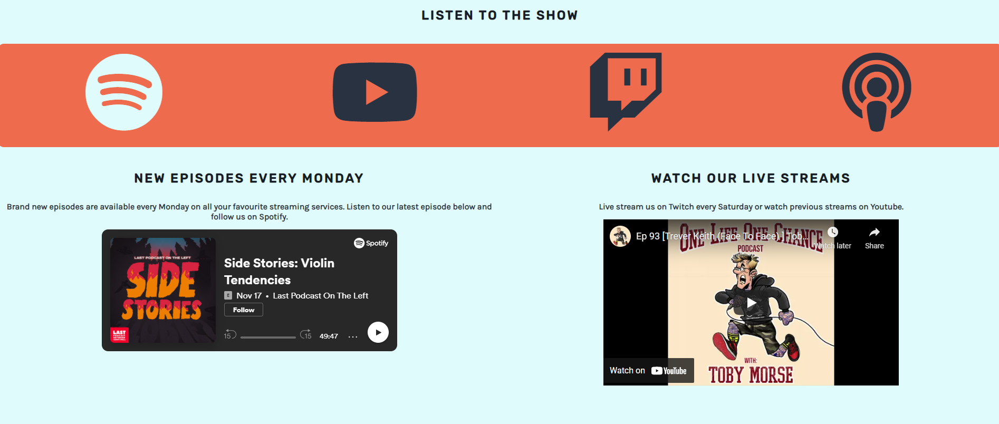

# REWINDER

REWINDER is the website designed for the fictional music discussion and review podcast, "REWINDER". The show's main theme is to take a retrospective look back at the music that shaped the guests lives. 

The aim for the site is to direct existing fans of the podcast to the best places to listen and interact with the show. REWINDERs target audience is fans of music and record collecting, to general fans of the guests. The REWINDER site will be particularly useful to fans wanting to find out more about when and where they can enjoy the podcast, as well as signing up to the newsletter and discovering tour dates.
The site is responsive and has layout variations dependent on the size of the devices screen.

View live site here: https://pez57.github.io/portfolio-1-rewinder/

## Table Of Contents
  * [Features](#features)
  * [Design](#design)
  * [User Stories](#user-stories)
  * [Testing](#testing)
  * [Deployment](#deployment)
  * [Technologies used](#technologies-used)
  * [Credits](#credits)
---
## Features

__Navigation__
The navigation logo and menu on the top of the landing page is an easy way for the user to navigate to their desired section within the site. The aim is to introduce users to what they expect to discover on the website and each menu option has been named accordingly to link to the corresponding section. 

__Landing Page__
The landing page has a background image of the podcast host and guest chatting in a record store. This represents the theme of the podcast and gives a new fan a visual first impression of the show. The text box is a short _about_ paragraph which simply informs the user of what the podcast is all about.

__Listen Section__
The listen section consists of a row of clickable icons & a _when_ subsection. The clickable icons externally link to the corresponding streaming services. The _when_ section informs the user when to expect new episodes and includes two embedded podcasts, one on a Spotify player and the other on a YouTube player. These two have been used as holding episodes as an example. 

__Subscribe__
The user can subscribe to our newsletter and leave us a message as they submit. The user must enter their name and e-mail address into the input fields for the form to submit; there are prompt messages that appear when this info is not present.

__Tour__
The _Tour_ section is a styled table of tour dates with external links to buy tickets for each event. 

__Footer__
The fixed footer contains a call to action to follow our social media pages. The REWINDER logo links the user back to the landing page.

__Hover__
Each clickable element on the website changes color when hovered over with the mouse. This is to let the user intuitively recognise that they are able to click the link or button.

## Design
__Theme__

The podcast show has a theme of detailed music discussion and record collecting. I kept this in mind when deciding on the logo font and color scheme. I wanted the colors of the website to be retro, contrasted by a modern font. The two fonts used are __Karla__ and __Rubik__ which are modern in style and complement each other, both of which were downloaded from [google fonts](https://https://fonts.google.com/).

__Color Pallette__

The color pallette consists of three contrasting colors which keep to the retro aesthetic.

__Imagery__

The hero image was chosen to give the user a visual representation of the podcast in session. The record store setting is impactful and gives a welcoming feel to the landing page. 

The icons used are logos for external platforms and social media websites. My intention with using icons instead of text is to keep the site looking clean and intuitive to the user.

__Wireframes__

I used Balsamiq to draft the layout of each page. This helped me scope the amount of content needed to achieve a clean layout.

## User Stories
- First time visitor aims:
  - As a first time visitor, I want to easily understand what the purpose of the website is about
  - As a first time visitor, I want the content to give me more information about the podcast
  - As a first time visitor, I want the navigation be easy, and the scrolling between sections to be smooth
  - As a first time visitor, I want to be able to find clickable links and media players to listen to content
- Returning visitor aims:
  - As a returning visitor, I want to be able to subscribe to a regular newsletter
  - As a returning visitor, I want to find links to follow the podcast on social media
  - As a returning visitor, I want to find out future tour dates with information and links to buy tickets

## Testing

Throughout the process I have been testing changes in the gitpod preview screen, and using dev tools to test small changes to the html and css code. I have committed regularly and detailed the changes made. 

__Validator Testing__

HTML: No errors reported

CSS: No errors reported

__Lighthouse__

__Bugs & Fixes__
No Bugs at time of deployment.
There was an issue with the landing page text box resizing on smaller screens. To fix this I changed it's display property to a flex box, and hid the text box on small mobile screens. Hiding the text box also improved the flow of the layout on smaller screens. 

## Deployment

The website was deployed to github pages using the following steps:
- Clicked on my repository for portfolio-1-rewinder. 
- Clicked settings tab and navigated down to "Pages"
- Selected "Main" in branch drop down box
- Clicked "save" which produced the live link which can be viewed here https://pez57.github.io/portfolio-1-rewinder/

## Technologies used

- HTML5: Used to make the structure and content of the site
- CSS3: Used to style the site content and appearance
- GITPOD: Used to code the website
- GITHUB: Used to store, deploy and host the site
- Balsamiq Wireframes: Used to draft page design and layout

## Credits

__Tools & Media__

- Fonts used supplied by [google fonts](https://https://fonts.google.com/)
- Hero image is a royalty free stock image from [pexels](https://pexels.com)
- Icons used made available by [fontawesome](https://fontawesome.com)
- Color Pallette constructed using the website [coolors](https://coolors.co)
- Spotify embedded player holding show features the content made by [Last Podcast on the Left](https://www.lastpodcastontheleft.com/)
- Youtube embedded player holding show features the content made by One Life One Chance Podcast
- Image at the beginning of this document constructed using http://ami.responsivedesign.is/

__Code and Tutorials__

- Nav bar code inspired by Code Institute Love Running tutorial
- Flex Box tutorials to help my layout  

- Form within a flex box tutorial. I used this tutorial to help me understand how to implement the submit form into a flex display https://www.quackit.com/css/flexbox/examples/flexbox_form_examples.cfm

